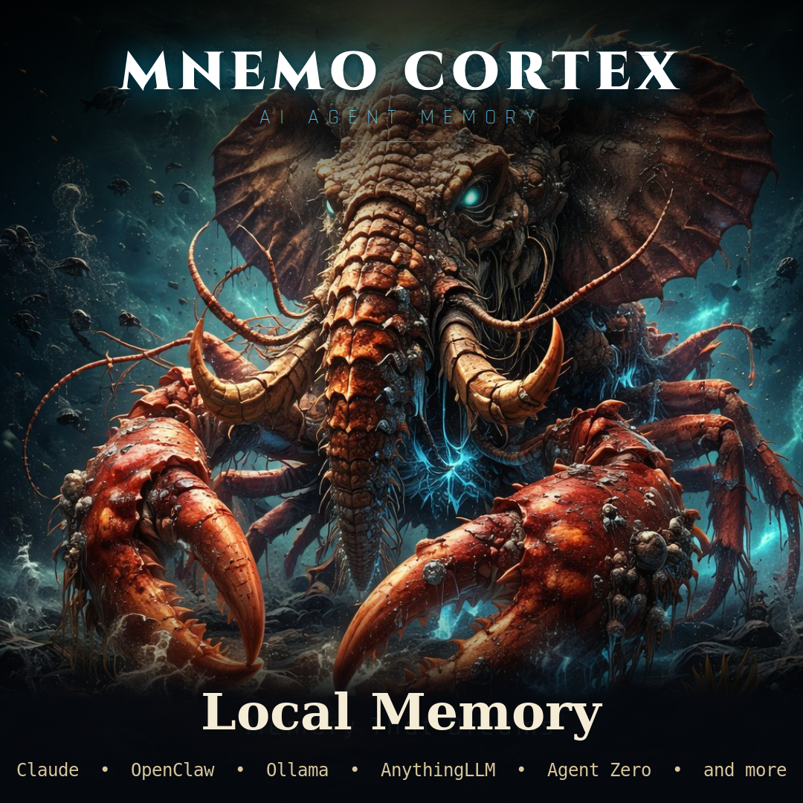

<p align="center">
  
</p>

# ⚡ Mnemo Cortex v2.3.2


## Deep Recall for Claude Code, Claude Desktop, and OpenClaw.

> Every AI agent has amnesia. Mnemo Cortex fixes that.
> Persistent memory that survives across sessions, searches by meaning, and costs $0 to run.

### 🚀 Get Started

⌘ **[Claude Code → 60-second install](integrations/claude-code/)** — Give CC Fluid Memory with Deep Recall

🖥️ **[Claude Desktop → MCP setup](integrations/claude-desktop/)** — Works on Windows, Mac, and Linux

🦞 **[OpenClaw → MCP integration](integrations/openclaw-mcp/)** — Give Your ClawdBot a Brain. One Config Line.

📋 **[What can it do? → Read the full Capabilities doc](CAPABILITIES.md)**

---

### Dreaming Mnemo — Cross-Agent Overnight Synthesis

Every night, Mnemo reads every connected agent's memories and synthesizes them into a single brief. Each agent wakes up knowing what the others did. No manual relay. No copy-paste. It just happens.

**This is the only AI memory system that does cross-agent synthesis.** Mem0, Zep, and Letta store memory per agent. Mnemo dreams across all of them.

### Works with Mem0

Already using Mem0? Keep it. Mnemo runs as a fast local working-memory layer in front of your existing Mem0 deployment. When Mnemo has what you need: sub-100ms local recall. When local results are thin: automatic fallback to Mem0 for depth. Writes sync both ways.

**"And Mem0" — not "instead of Mem0."**

### Deploy Your Way

- **Shared** — One Mnemo for all agents. Cross-agent search and dreaming. Full team awareness.
- **Isolated** — Separate Mnemo per agent or per customer. Zero bleed between tenants.
- **Hybrid** — Shared for internal agents + isolated for customer-facing bots. This is what we run.

Mem0 makes you choose one shared store. Mnemo lets you architect for your actual privacy and separation needs.

---

### *A Crustacean That Never Forgets* 🧠🦞

🤖 **ClaudePilot Enabled** — [AI-guided installation](CLAUDEPILOT.md). Designed for Claude (free). Works with ChatGPT, Gemini, and others.

Proven on two live agents — Rocky with six weeks of recall, Alice with one.

```
OpenClaw Agent ──writes──▶ Session Tape (disk)
                                │
                          Watcher Daemon ──reads──▶ Mnemo v2 SQLite
                                                        │
                          Refresher Daemon ◀──reads─────┘
                                │
                          writes──▶ MNEMO-CONTEXT.md ──▶ Agent Bootstrap
```

## Health Monitoring

Built-in deployment verification. No agent runs without verified memory.

```
mnemo-cortex health
```

```
mnemo-cortex health check
=========================

Core Services
  API server (http://artforge:50001) ...... OK (v2.1.0, 156 memories, 42ms)
  Database ................................. OK (12 sessions (3 hot, 4 warm, 5 cold))
  Compaction model ......................... OK (qwen2.5:32b-instruct — responding)

Agents (3 discovered)
  rocky .................................... OK (recall returned 5 results (234ms))
  cc ....................................... OK (recall returned 3 results (189ms))
  opie ..................................... OK (recall returned 4 results (201ms))

Watchers
  mnemo-watcher-cc ......................... OK (active, PID 4521)
  mnemo-refresh ............................ OK (active, PID 4523)

MCP Registration
  openclaw.json ............................ OK (mnemo-cortex registered)

14/14 checks passed
```

Options: `--json` (machine-readable) · `--quiet` (exit code only) · `--agents` (agent checks only) · `--services` (watcher checks only) · `--check-mcp <path>` (validate MCP configs)

Wire to cron: `0 */6 * * * mnemo-cortex health --quiet || your-alert-command`

## Auto-Capture

Every agent conversation captured automatically. No manual saves, no hooks, no code changes.

### How It Works

Mnemo watches your agent's session files from the outside and ingests every message as it happens. Two adapter patterns depending on your agent platform:

| Platform | Capture Method | Command |
|----------|---------------|---------|
| **OpenClaw** | Session file watcher (tails JSONL) | `mnemo-cortex watch --backfill` |
| **Claude Code** | Session file watcher (same) | `mnemo-cortex watch --backfill` |
| **Claude Desktop** | MCP tools (save/recall/search) | [Setup guide](integrations/claude-desktop/) |

### Quick Start

```bash
# 1. Start Mnemo (if not already running)
mnemo-cortex start

# 2. Start auto-capture
mnemo-cortex watch --backfill
```

That's it. Every exchange your agent has is now captured, compressed, and searchable.

### Always-On Auto-Capture

Set the `MNEMO_AUTO_CAPTURE` environment variable to start the watcher automatically whenever Mnemo starts:

```bash
# Add to your shell profile (~/.bashrc, ~/.zshrc, etc.)
export MNEMO_AUTO_CAPTURE=true
```

With this set, `mnemo-cortex start` also starts the session watcher — no separate `watch` command needed.

### What Gets Captured

- Every user message and agent response
- Tool calls and results
- Session boundaries and timestamps
- All compressed via rolling compaction (80% token reduction, zero information loss on named entities)

### Verify It's Working

```bash
mnemo-cortex status
```

Look for:
```
  Watcher:    running (PID 4521) — auto-capturing sessions
```

Or check the database directly:
```bash
mnemo-cortex recall "what happened today"
```

---

## What It Does

Mnemo Cortex v2 is a **sidecar memory coprocessor** for AI agents. It watches your agent's session files from the outside, ingests every message into a local SQLite database, compresses older messages into summaries via LLM-backed compaction, and writes a `MNEMO-CONTEXT.md` file that your agent reads at bootstrap.

No hooks. No agent modifications. No cloud dependency. Mnemo keeps your memory on disk — if either process restarts, the data is already there.

## Key Features

- **SQLite + FTS5 storage** — Single database file. Full-text search. Zero dependencies beyond Python stdlib.
- **Context frontier with active compaction** — Rolling window of messages + summaries. 80% token compression while preserving perfect recall.
- **DAG-based summary lineage** — Every summary tracks its source messages via a directed acyclic graph. Expand any summary back to verbatim source.
- **Verbatim replay mode** — Compressed by default, original messages on demand.
- **OpenClaw session watcher daemon** — Tails JSONL session files and ingests new messages every 2 seconds.
- **Context refresher daemon** — Writes `MNEMO-CONTEXT.md` to the agent's workspace every 5 seconds.
- **Provider-backed summarization** — Compaction summaries generated by local Ollama (qwen2.5:32b-instruct) at $0. Any LLM provider supported as fallback.
- **Sidecar design** — Version-resistant. Observes from the outside. Never touches agent internals.

## Live Stats (March 2026)

Proven on two live OpenClaw agents:

| Agent | Host | Messages | Summaries | Conversations | Recall |
|-------|------|----------|-----------|---------------|--------|
| **Alice** | THE VAULT (Threadripper) | 210+ | 18+ | 5 | 1 week |
| **Rocky** | IGOR (laptop) | 3,000+ | 429+ | 20+ | 6 weeks |

## Install Guide

> 🤖 **ClaudePilot Enabled** — [Follow the guide in CLAUDEPILOT.md](CLAUDEPILOT.md) and paste it into [claude.ai](https://claude.ai). Claude becomes your personal installer. No experience needed. Works with ChatGPT, Gemini, and others.

### Platforms

Mnemo Cortex runs on **Linux, macOS, and Windows**. The core (Python + SQLite) is cross-platform. Platform-specific differences:

| | Linux | macOS | Windows |
|---|---|---|---|
| **Server** | systemd | launchd / manual | Task Scheduler / manual |
| **Claude Code** | Full support | Full support | Full support |
| **Claude Desktop** | Full support | Full support | Full support |
| **OpenClaw** | Full support | Full support | Full support |

### Prerequisites

- Python 3.11+
- An OpenClaw agent with session files in `~/.openclaw/agents/<agent>/sessions/` (if using OpenClaw)
- OpenRouter API key (for LLM-backed summaries; falls back to deterministic if unavailable)

### Step 1: Clone and set up

```bash
git clone https://github.com/GuyMannDude/mnemo-cortex.git
cd mnemo-cortex
python -m venv .venv
source .venv/bin/activate
pip install -e .
```

### Step 2: Create data directory

```bash
mkdir -p ~/.mnemo-v2
```

### The Sparks Patch Method

When editing config files (scripts, .env, openclaw.json, etc.), don't replace the whole file. Instead, show three things:

**1. FIND THIS** — a few lines of the existing file so you can find the exact spot:
```
"settings": {
  "model": "old-model-name",    ← this is what you're changing
  "temperature": 0.7
}
```

**2. CHANGE TO THIS** — just the line(s) that change:
```
  "model": "new-model-name",
```

**3. VERIFY** — the edited section with surrounding context so you can confirm it's right:
```
"settings": {
  "model": "new-model-name",    ← changed
  "temperature": 0.7
}
```

Find the landmark, make the edit, visually confirm it matches. Use this method for every config file edit throughout the installation.

### Step 3: Create watcher script

Create `mnemo-watcher.sh` (adjust paths for your agent):

```bash
#!/usr/bin/env bash
SESSIONS_DIR="$HOME/.openclaw/agents/main/sessions"
DB="$HOME/.mnemo-v2/mnemo.sqlite3"
CHECKPOINT="$HOME/.mnemo-v2/watcher.offset"
AGENT_ID="rocky"  # your agent's name
INTERVAL=2

cd /path/to/mnemo-cortex
source .venv/bin/activate
mkdir -p "$HOME/.mnemo-v2"

LAST_FILE=""
while true; do
    NEWEST=$(ls -t "$SESSIONS_DIR"/*.jsonl 2>/dev/null | head -1)
    if [[ -z "$NEWEST" ]]; then sleep "$INTERVAL"; continue; fi
    if [[ "$NEWEST" != "$LAST_FILE" ]]; then
        SESSION_ID=$(basename "$NEWEST" .jsonl)
        echo "0" > "$CHECKPOINT"
        LAST_FILE="$NEWEST"
        echo "[mnemo-watcher] Tracking session: $SESSION_ID"
    fi
    python3 -c "
from mnemo_v2.watch.session_watcher import SessionWatcher
w = SessionWatcher(\"$DB\", \"$NEWEST\", \"$CHECKPOINT\")
n = w.poll_once(agent_id=\"$AGENT_ID\", session_id=\"$SESSION_ID\")
if n > 0:
    print(f\"[mnemo-watcher] Ingested {n} messages\")
"
    sleep "$INTERVAL"
done
```

### Step 4: Create refresher script

Create `mnemo-refresher.sh`:

```bash
#!/usr/bin/env bash
SESSIONS_DIR="$HOME/.openclaw/agents/main/sessions"
DB="$HOME/.mnemo-v2/mnemo.sqlite3"
OUTPUT="$HOME/.openclaw/workspace/MNEMO-CONTEXT.md"
AGENT_ID="rocky"  # your agent's name
INTERVAL=5

cd /path/to/mnemo-cortex
source .venv/bin/activate
mkdir -p "$HOME/.mnemo-v2"

while true; do
    NEWEST=$(ls -t "$SESSIONS_DIR"/*.jsonl 2>/dev/null | head -1)
    if [[ -n "$NEWEST" ]]; then
        SESSION_ID=$(basename "$NEWEST" .jsonl)
        python3 -c "
from mnemo_v2.watch.context_refresher import ContextRefresher
r = ContextRefresher(\"$DB\", \"$OUTPUT\")
ok = r.refresh_once(agent_id=\"$AGENT_ID\", session_id=\"$SESSION_ID\")
if ok:
    print(\"[mnemo-refresher] MNEMO-CONTEXT.md updated\")
"
    fi
    sleep "$INTERVAL"
done
```

### Step 5: Install as systemd user services

```bash
mkdir -p ~/.config/systemd/user

cat > ~/.config/systemd/user/mnemo-watcher.service << 'EOF'
[Unit]
Description=Mnemo v2 Session Watcher
After=network.target

[Service]
Type=simple
ExecStart=%h/path/to/mnemo-watcher.sh
Restart=on-failure
RestartSec=5
Environment=PYTHONUNBUFFERED=1

[Install]
WantedBy=default.target
EOF

cat > ~/.config/systemd/user/mnemo-refresher.service << 'EOF'
[Unit]
Description=Mnemo v2 Context Refresher
After=mnemo-watcher.service

[Service]
Type=simple
ExecStart=%h/path/to/mnemo-refresher.sh
Restart=on-failure
RestartSec=5
Environment=PYTHONUNBUFFERED=1

[Install]
WantedBy=default.target
EOF

systemctl --user daemon-reload
systemctl --user enable --now mnemo-watcher mnemo-refresher
```

### Step 6: Patch the bootstrap hook (OpenClaw)

Replace your `mnemo-ingest` handler to read from disk instead of calling the v1 API:

```typescript
import { HookHandler } from "openclaw/plugin-sdk";
import { readFileSync } from "fs";
import { join } from "path";

const WORKSPACE = process.env.OPENCLAW_WORKSPACE || join(process.env.HOME || "", ".openclaw", "workspace");
const CONTEXT_FILE = join(WORKSPACE, "MNEMO-CONTEXT.md");

const handler: HookHandler = async (event) => {
  if (event.type === "agent" && event.action === "bootstrap") {
    try {
      const content = readFileSync(CONTEXT_FILE, "utf-8").trim();
      if (content && event.context.bootstrapFiles) {
        event.context.bootstrapFiles.push({ basename: "MNEMO-CONTEXT.md", content });
      }
    } catch {}
  }
};

export default handler;
```

### Step 7: Backfill existing sessions

```bash
source .venv/bin/activate
for f in ~/.openclaw/agents/main/sessions/*.jsonl; do
  SID=$(basename "$f" .jsonl)
  python3 -c "
from mnemo_v2.watch.session_watcher import SessionWatcher
from pathlib import Path
import tempfile, os
cp = Path(tempfile.mktemp()); cp.write_text('0')
w = SessionWatcher('$HOME/.mnemo-v2/mnemo.sqlite3', '$f', str(cp))
n = w.poll_once(agent_id='your-agent', session_id='$SID')
print(f'Ingested {n} messages from $SID')
os.unlink(str(cp))
"
done
```

### Step 8: Verify

```bash
# Check services
systemctl --user status mnemo-watcher mnemo-refresher

# Check database
python3 -c "
import sqlite3
conn = sqlite3.connect('$HOME/.mnemo-v2/mnemo.sqlite3')
for t in ['conversations', 'messages', 'summaries']:
    n = conn.execute(f'SELECT COUNT(*) FROM {t}').fetchone()[0]
    print(f'{t}: {n}')
"

# Check context file
cat ~/.openclaw/workspace/MNEMO-CONTEXT.md
```

## Troubleshooting

**Recall / cross-agent search returns "No chunks"**

Most common cause: your embedding model setting doesn't match your provider's current model name. Model names change — check your provider's docs:

| Provider | Current Embedding Model | Deprecated / Dead |
|----------|------------------------|-------------------|
| **Ollama (local)** | `nomic-embed-text` | — |
| **OpenAI** | `text-embedding-3-small` | `text-embedding-ada-002` |
| **Google** | `gemini-embedding-001` | `text-embedding-004` (shut down Jan 2026) |

If you recently switched providers or updated your config, verify the model name is correct and that your API key has access to the embedding endpoint.

**Health check fails on "Compaction model"**

The compaction model (default: `qwen2.5:32b-instruct` via Ollama) must be running and reachable. Check:
```bash
curl http://localhost:11434/v1/models  # List loaded Ollama models
```

If you're using a remote Ollama instance, set `MNEMO_SUMMARY_URL` to point to it.

**Server unreachable**

If `mnemo-cortex health` can't reach the API, check:
```bash
curl http://localhost:50001/health    # Or your MNEMO_URL
```

Common causes: wrong port, firewall blocking, server not started. On multi-machine setups, ensure the target host's firewall allows the port (e.g., `ufw allow from 10.0.0.0/24 to any port 50001`).

## Verify Installation

After setup, run the smoke test to confirm everything works:

```bash
cd /path/to/mnemo-cortex
source .venv/bin/activate
pytest tests/test_smoke.py -v
```

Expected output (all 4 assertions must pass):

```
tests/test_smoke.py::test_ingest_compact_expand PASSED

What it verifies:
  ✅ Ingest: 24 messages stored successfully
  ✅ Conversation: agent/session pair created
  ✅ Compaction: summaries generated from message chunks
  ✅ Expansion: summary expands back to source messages (verbatim)
```

If the test fails, check that all Python dependencies are installed (`pip install -e .`).

## Architecture

```
mnemo_v2/
  api/server.py              FastAPI app (optional — v2 works without it)
  db/schema.sql              Canonical schema + FTS5 tables
  db/migrations.py           Schema bootstrap and compatibility checks
  store/ingest.py            Durable transcript ingest + tape journaling
  store/compaction.py        Leaf/condensed compaction with LLM summarization
  store/assemble.py          Active frontier → model-visible context
  store/retrieval.py         FTS5 search + source-lineage replay
  watch/session_watcher.py   Tails JSONL session logs into the store
  watch/context_refresher.py Writes MNEMO-CONTEXT.md on an interval
```

### Design Rules

- Immutable transcript in `messages`
- Mutable active frontier in `context_items`
- Summaries are derived, never destructive
- Raw tape is append-only for crash recovery
- Compaction events are journaled
- Replay supports `snippet` or `verbatim`
- Expansion is always scoped to a conversation

### Schema

See [`mnemo_v2/db/schema.sql`](mnemo_v2/db/schema.sql) for the full schema. Key tables:

| Table | Purpose |
|-------|---------|
| `conversations` | Agent + session pairs |
| `messages` | Immutable transcript (role, content, seq) |
| `summaries` | Compacted summaries with depth and lineage |
| `summary_messages` | Links summaries to source messages |
| `summary_sources` | Links condensed summaries to leaf summaries (DAG) |
| `context_items` | The active frontier (what the agent sees) |
| `compaction_events` | Audit log of all compaction operations |
| `raw_tape` | Append-only crash recovery journal |

## Mnemo Cortex vs OpenClaw Active Memory

OpenClaw 2026.4.10 shipped a native Active Memory plugin. Some people have asked whether it replaces Mnemo Cortex. Short answer: no — they solve different problems. Here's the difference, based on testing both on our Sparky sandbox agent.

|                     | Active Memory (native)         | Mnemo Cortex (MCP)                          |
|---------------------|-------------------------------|---------------------------------------------|
| **Scope**           | Single agent                  | Cross-agent (multi-agent bus)               |
| **Store**           | Local workspace files + FTS   | Centralized SQLite + embeddings             |
| **Persistence**     | Per-agent, per-workspace      | Survives resets, sessions, machine moves     |
| **Cross-session**   | Within one agent's workspace  | Any agent, any machine                      |
| **Integration**     | Independent store             | Independent store                           |

### When to use which

- **Active Memory:** Intra-session, same-agent, fast local recall. Your agent's personal scratchpad.
- **Mnemo Cortex:** Cross-agent memory bus. When Agent A needs to know what Agent B learned. When memory must survive session resets, machine moves, or agent restarts.

We run both. Active Memory handles per-agent recent context. Mnemo handles everything that crosses agents or needs durable archival. They stack; they don't compete.

## Origin Story

For two years, Guy Hutchins — a 73-year-old maker in Half Moon Bay — acted as the "Human Sync Port" for his AI agents, manually copying transcripts between sessions. Then came OpenClaw, Rocky, and a $100 Claude subscription. In one session, Guy, Rocky, and Opie designed a memory coprocessor that actually worked. They named it Mnemo Cortex.

v2.0 was a team effort: **Opie** (Claude Opus) designed the architecture, **AL** (ChatGPT) built the implementation, **CC** (Claude Code) deployed and integrated it, **Alice** and **Rocky** (OpenClaw agents) served as live test subjects, and **Guy Hutchins** made it all happen.

Read the full story: [Finding Mnemo](FINDING-MNEMO.md)

## Credits

- **Guy Hutchins** — Project lead, testing, and the reason any of this exists
- **Rocky Moltman** 🦞 — Creative AI partner, first v2.0 production user
- **Opie** (Claude Opus 4.6) — Architecture design, schema design, compaction strategy
- **AL** (ChatGPT) — Implementation, watcher/refresher daemons, test suite
- **CC** (Claude Code) — Deployment, integration, live testing, bug fixes
- **Alice Moltman** — Live test subject on THE VAULT, first v2.0 user

Inspired in part by exploration of lossless conversation logging approaches, including [Lossless Claw](https://github.com/Martian-Engineering/lossless-claw) by Martian Engineering.

Built for [Project Sparks](https://projectsparks.ai).

## Works Great With

- **[ClaudePilot OpenClaw](https://github.com/GuyMannDude/claudepilot-openclaw)** — free AI-guided setup guide. Get an OpenClaw agent running with memory in one afternoon.

## License

MIT
